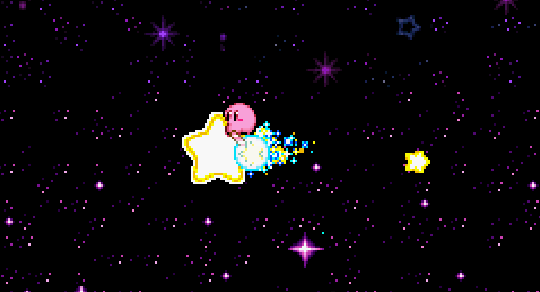
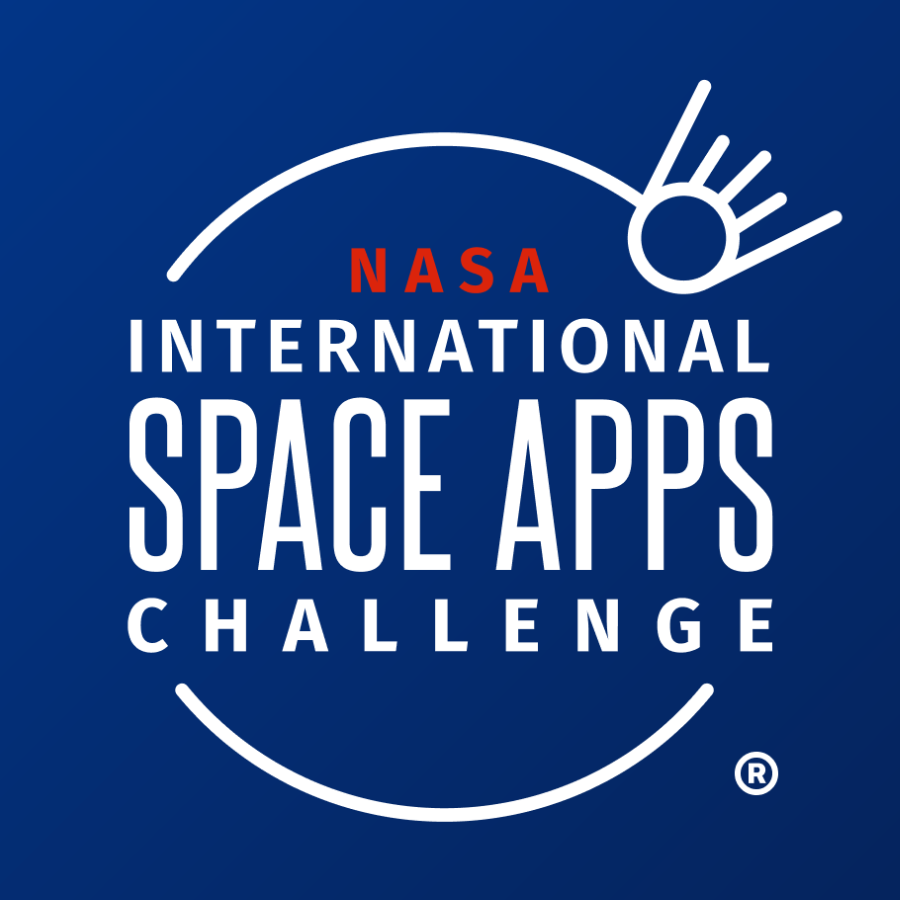
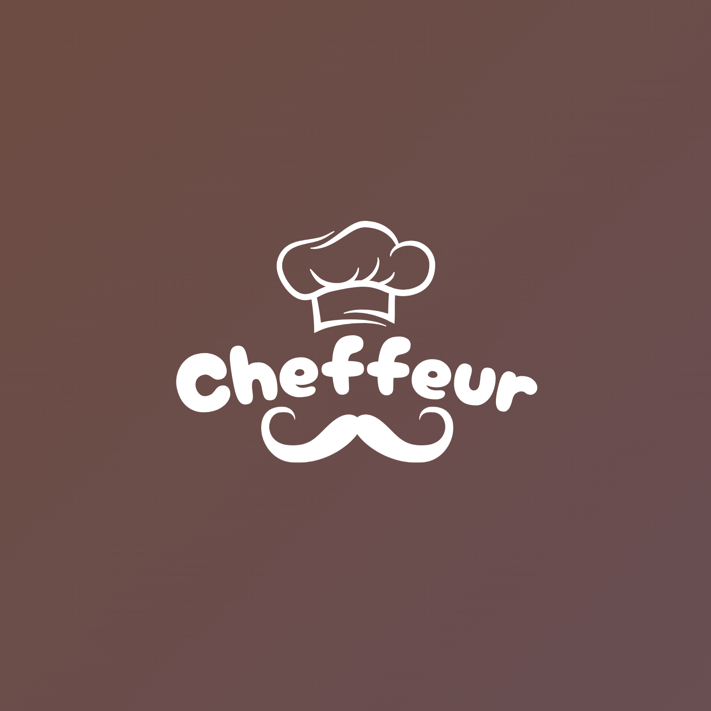

 <h1>
  
</h1>

  

# ❓ About this Repository

  
 This repository contains all of my files and projects related to the subject<i> CPE 411 - Interactive Extended Reality. </i>

# 📋 Repository Contents

 This README.md File (Seatwork 1) 

 Hands-on Activity 1.1 Introduction to Design Tools for HCI - BULAONG 

 Hands-on Activity 1.2 Navigating Unity Editor - BULAONG

 Hands-on Activity 1.4 Starting the Unity Essentials Pathway (Editor & 3D Esssentials) - BULAONG

 Hands-on Activity 1.5 Audio Essentials - BULAONG

 Hands-on Activity 1.6 Programming Essentials - BULAONG

 Cheffeur Reheated - BULAONG ||  <a src='https://www.figma.com/design/XpS7keG6smZ9dQF0pz0fwI/Cheffeur-Reheated?node-id=3-13&t=knSZJXymsaiWbE8F-1'> Check my project out!</a> 
 

# 📂 Small Portfolio 

## 💪 My Skills

### 💻 Programming & Development

  
  
  
  

### 🎨 Design & Prototyping

  
  
  

### 🏆 Notable Projects

# 👀 Profile Views

  

